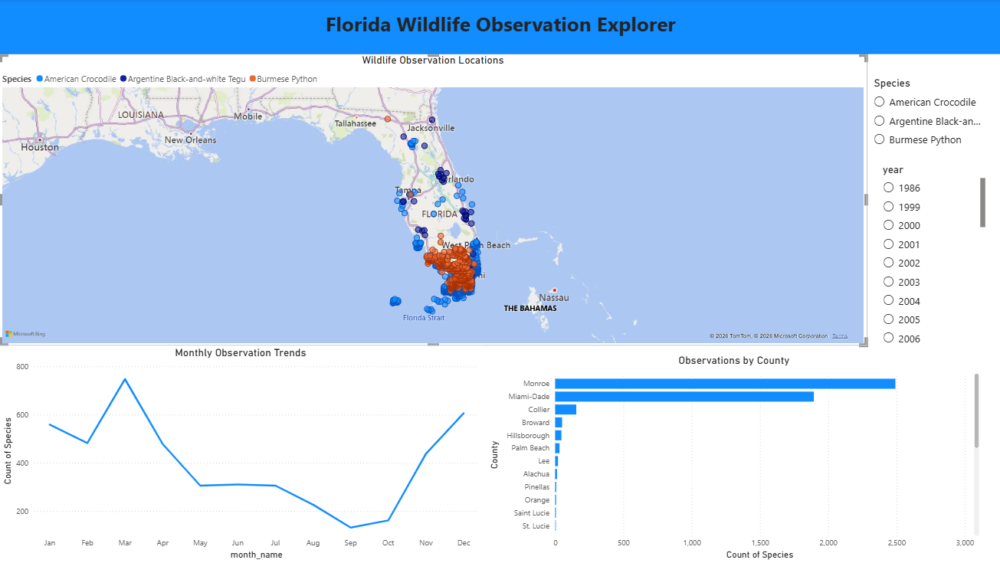
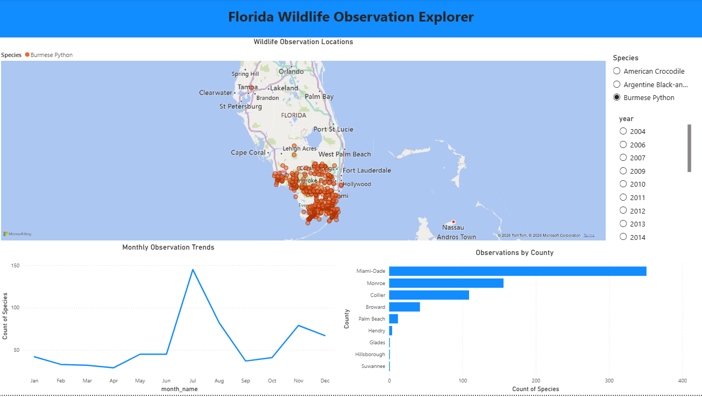
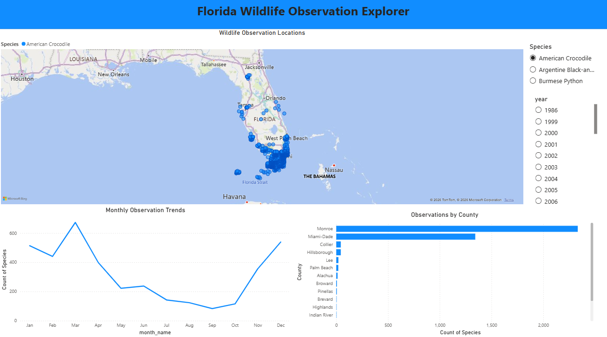

# Florida Wildlife Observation Analysis and Prediction

## Overview

This project uses wildlife observation data from iNaturalist to analyze the distribution of American Crocodiles, Burmese Pythons, and Argentine Black-and-white Tegus in Florida and predict species identity using machine learning.

## Objectives

- Build and query a relational MySQL database
- Perform exploratory data analysis
- Engineer temporal and geographic features
- Compare machine learning classification models
- Evaluate model performance using Macro F1-score

## Tools

- Python
- Pandas
- NumPy
- MySQL
- Matplotlib
- Plotly
- Scikit-learn

## Results

- Random Forest achieved the best performance with a Macro F1-score of 0.843.
- Geographic location was the strongest predictor of species identity.
- Seasonal patterns contributed meaningful predictive information.
- A wet/dry season feature improved Macro F1-score to 0.852.

## Author

Joseph Crea

## Interactive Dashboard

An interactive Power BI dashboard was developed to explore wildlife observation patterns across Florida.

### Dashboard Overview

### Burmese Python Analysis

### American Crocodile Analysis

Dashboard File

[Download the Power BI Dashboard](dashboard/Florida_Wildlife_Observation_Explorer.pbix)

## Interactive Wildlife Prediction App

This project includes an interactive Streamlit application that allows users to predict wildlife species observations across Florida.

### Features

* Interactive Florida map using Folium
* Automatic county detection using GeoPandas
* Random Forest classification model
* Top 3 predicted species with confidence scores
* Geospatial wildlife prediction based on location and seasonality

### How It Works

1. Click a location on the Florida map.
2. The application automatically determines the county.
3. Select the month and year.
4. The trained Random Forest model generates species predictions.
5. The application displays the top predicted species and confidence scores.

### Technologies

* Streamlit
* Folium
* GeoPandas
* Scikit-learn
* Pandas
* Python

## Live Application

## Live Application

[Launch the Streamlit App](https://florida-wildlife.streamlit.app/)
